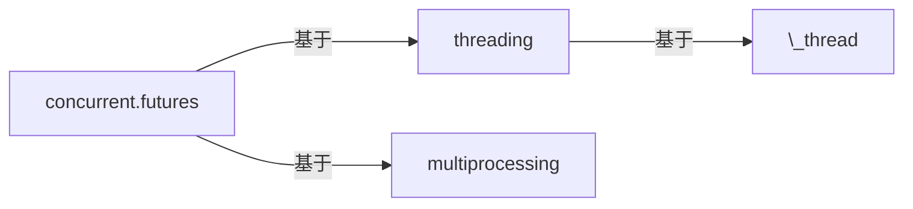

将数学表达式放在<span>$</span>...\$之间：

\\(\LaTeX{}\\)

$\Pi$

$ a * b = c ^ b $

$ 2^{\frac{n-1}{3}} $

$ \int\_a^b f(x)\,dx. $

\\( \int\_a^b f(x)\,dx. \\)

$$
\begin{cases}
\text{如果为真}\ foo \\
\text{如果为假}\ bar
\end{cases}
$$

$ \rho {\rm{FOD}} = \sum\limits{\sigma ,i} {(\delta _1 - \delta _2 n_i^\sigma )|\phi _i^\sigma ({\bf{r}})|^2} $

$$ \rho {\rm{FOD}} = \sum\limits{\sigma ,i} {(\delta _1 - \delta _2 n_i^\sigma )|\phi _i^\sigma ({\bf{r}})|^2} $$


{{ "这是一个liquid过滤器。" | capitalize }}


\`转义内联代码\`  
`内联代码`  
这是一个**捕获块**。


{{ test | markdownify }}

 
100 / 3 = {{ x }}

:+1:
:bolivia:

\1. 21312  
\2. 21312  
\4. 4214  


import networkx as nx
from collections import Counter

diagrams = defaultdict(list)
particle_counts = defaultdict(Counter)

for (a, b), neighbors in common_neighbors.items():
    # 构建a和b的共同邻居之间的连接图
    g = nx.Graph()
    for i in neighbors:
        for j in set(nl.point_indices[
            nl.query_point_indices == i]).intersection(neighbors):
            g.add_edge(i, j)

    # 定义CNA图的标识符：
    # 第一个整数表示粒子是否键合，1表示是，2表示否
    # 第二个整数是共享邻居的数量
    # 第三个整数是共享邻居之间的键数
    # 第四个整数是索引，用于确保图的唯一性
    diagram_type = 2-int(b in nl.point_indices[nl.query_point_indices == a])
    key = (diagram_type, len(neighbors), g.number_of_edges())
    # 如果我们见过任何具有此签名的邻域图，
    # 我们显式检查两个图是否相同以确定是否保存此图。
    # 否则，我们立即添加新图。
    if key in diagrams:
        isomorphs = [nx.is_isomorphic(g, h) for h in diagrams[key]]
        if any(isomorphs):
            idx = isomorphs.index(True)
        else:
            diagrams[key].append(g)
            idx = diagrams[key].index(g)
    else:
        diagrams[key].append(g)
        idx = diagrams[key].index(g)
    cna_signature = key + (idx,)
    particle_counts[a].update([cna_signature])


```cpp
void insert(const char* key) {
    if (*key == '\0') {
        finish = true;
    } else {
        int idx = *key - 'A';
        if (!next[idx])
            next[idx] = new Trie();
        next[idx]->insert(key + 1);
    }
}
```

```ruby
p ":+1:"
```

``` diff
+        'user_exists' => 'SELECT EXISTS(SELECT 1 FROM table WHERE username = (:username || \'@sample'))',
+        'get_users' => 'SELECT split_part(username, \'@\', 1) FROM table WHERE (username ILIKE :search) OR (name ILIKE :search)',
+        'get_password_hash_for_user' => 'SELECT split_part(password, \'{CRYPT}\', 2) FROM table WHERE username = (:username || \'@sample\')',
+        'set_password_hash_for_user' => 'UPDATE table SET password =  \'{CRYPT}\' || :new_password_hash WHERE username = (:username || \'@sample\')',
```

重新加载Nginx：

``` console
$ sudo nginx -s reload
```

|:                        |:                  :|: $$O_3 + C_2H_2 \rightarrow $$         :|||:  $$O_3 + C_2H_4 \rightarrow $$ :|||:       :| 
|:  ^^ 方法              :| ^^ $$\lambda^a$$  |    vdW |    TS |    环加成               |  vdW  |  TS  |  环加成              | ^^ MAE    |
|-------------------------|-------------------|--------|-------|------------------------|-------|------|----------------------|-----------|
| $$\lambda$$-tPBE        |   0.20            | -0.40  | 7.69  | -68.00                 | -1.86 | 4.87 | -57.57               | 1.29      |
|-------------------------|-------------------|--------|-------|------------------------|-------|------|----------------------|-----------|
| MC1H-PBE $$^b$$         |   0.25            | -1.08  | 3.66  | -70.97                 | -1.25 | 0.13 | -61.26               | 3.35      |
|-------------------------|-------------------|--------|-------|------------------------|-------|------|----------------------|-----------|
| 参考值 $$^c$$           |   ---------       | -1.90  | 7.74  | -63.80                 | -1.94 | 3.37 | -57.15               | --------- |
|=========================|===================|========|=======|========================|=======|======|======================|===========|
| $$^a$$ 最佳混合参数。$$\~$$ $$^b$$ 来自参考文献。$$\~$$  $$^c$$ 参考文献中的最佳估计值。 ||||||||


|   1   |  2     |   3   |   4   |  5   |  6   |  7  |
| 跨单元格1     ||   跨单元格2  || 单元格 | 跨单元格3 ||
|^^ 跨单元格1   ||   跨单元格2  || 单元格 | 跨单元格3 ||
{:class="custom-table"}

<script>
|:-----:|:-----:|:-----:|:-----:|
| (0,0) | (0,1) | (0,2) | (0,3) |
|     (1,0)    || ^^    | (1,3) |
</script>


|:-----:|:-----:|:-----:|:-----:| ---- |
| (0,0) | (0,1) | (0,2) | (0,3) |      |
|     (1,0)    || ^^    | (1,3) |      |


|:-----:|:-----:|:-----:|:-----:| ---- |
| (0,0) | (0,1) | (0,2) | (0,3) |      |
|     (1,0)           ||| (1,3)       ||


|:-----:|:-----:|:-----:|:-----:| ---- |
| (0,0) | (0,1) | (0,2) | (0,3) |      |
|     (1,0)           ||| ^^    |      |

|:-----:|:-----:|:-----:|:-----:| ---- |
| (0,0) | (0,1) | (0,2) | (0,3) |      \
|     (1,0)           ||| ^^    |      |


## 表格

| 阶段 | 直接产物 | ATP产量 |
| ----: | --------------: | ---------: |
|糖酵解 | 2 ATP                   ||
|^^         | 2 NADH      | 3--5 ATP   |
|丙酮酸氧化 | 2 NADH | 5 ATP   |
|柠檬酸循环  | 2 ATP           ||
|^^                 | 6 NADH | 15 ATP  |
|^^                 | 2 FADH | 3 ATP   |
|                        30--32 ATP  |||


{:color-style: style="background: black;" }
{:color-style: style="color: white;" }
{:font-style: style="font-weight: 900; text-decoration: underline;" }

|:             这是一个内联属性列表示例                 :||||
| ------- | ------------------------- | -------------------- | ----------- |
|:       :|:  <div style="color: red;"> < 普通HTML块 > </div> :|||
| ^^      |   红色    {: .cls style="background: orange" }                |||
| ^^ IALs |   绿色  {: #id style="background: green; color: white" }    |||
| ^^      |   蓝色   {: style="background: blue; color: white" }         |||
| ^^      |   黑色  {: color-style font-style}                          |||


[cell image]: https://jekyllrb.com/img/octojekyll.png "示例图片"

| 标题            | 列1      | 列2                           |
|--------------------|---------------|------------------------------------|
| 行1              | 苹果[^1]     | [Youtube (主页)]                   |
| 行2              | 香蕉        | [Github][1]                        |
| 行3 (合并)     | 蓝莓     | [Google] *****  [Github]           |
| ^^         | [李子](https://example.com) | 树莓 ![示例][cell image]   |
| 行4      | <https://www.google.com>    |  [测试](https://www.google.com){:target="_blank"}                            |
|^^          |^^ <https://www.youtube.com> |                              |
| 行5      | <https://www.google.com>                                  ||

[Youtube (主页)]: https://www.youtube.com
[Google]: https://www.google.com
[Github]: https://www.github.com
[1]: https://www.github.com
[^1]: 脚注

<https://www.google.com>

不在表格中：`<邮件网关>`

在表格中：

决策点 | 设计决策
--- | ---
权威DNS MX记录 | `<邮件网关>`

9 \* 9

| 1 \* 1 = 1 |
| 1 \* 2 = 2 | 2 \* 2 = 4 |
| 1 \* 3 = 3 | 2 \* 3 = 6 | 3 \* 3 = 9  |
| 1 \* 3 = 3 | 2 \* 3 = 6 | 3 \* 4 = 12 | 4 \* 4 = 16 |

## 表情符号
:+1:

## Mathjax

$\LaTeX{}$

## PlantUML

@startuml
Bob -> Alice : 你好
@enduml

## Mermaid



## 视频


[\[视频链接\]](//www.youtube.com/watch?v=Ptk_1Dc2iPY)

## 音频

[HTML5音频格式测试](https://hpr.dogphilosophy.net/test/)

Opus音频(".opus"):


"MP3"文件(".mp3") :


WebM音频(".weba"):


WebMv2音频(".webm"):


Ogg Vorbis(".ogg") :


"wave"文件(".wav") :


FLAC文件(".flac") :


CAF文件(".caf") :


Spotify播客:


## 特殊媒体链接

本地视频文件(".webm"):


带自定义缩略图的视频:

[](https://www.youtube.com/watch?v=kCHGDRHZ4eU)

提示：
* 使用管道符(`|`)分隔列，使用破折号分隔标题行和表格内容。
* 间距对Markdown处理器无关紧要，任何额外的空白都会被删除，但它确实有助于提高可读性。
下面的两个Markdown示例都创建了这个表格。

使用管道符`(`|`)`分隔列，使用破折号分隔标题行和表格内容。
